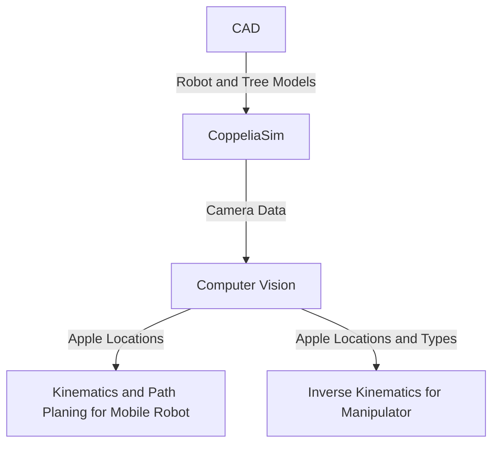

# Apple picker Robot

## Team Members and Roles
#### Eva-Jessy Guech
Implemented kinematics for control of the mobile robot to get to the apples.
#### Amara Suehrstedt
Implemented computer vision for finding and sorting the different kind of apples. Worked on project description.
#### Nathan Law
Created the CAD files for both the robot and the tree, and implemented both into CoppeliaSim.
#### Henry Liu
Implemented invserse kinematics for the manipulator arm to pick the apples.

## Introduction
In this project, we will demonstrate a robot that will find and sort two different kinds of apples (good or bad), move to the apples, put the good apples into the basket on the robot, and the bad apples elsewhere. The ECSE 275 concepts we are using are path planning, inverse kinematics, computer vision, and visual based control of steering.

## Approach
### Overall Flow Chart

### CAD

### Computer Vision
The computer vision function was implemented using OpenCV, numpy, in python. It works by grabbing the image, sensor data, and sensor depth data from the vision sensor in CoppeliaSim. After this, it uses HSV thresholding to determine what is an apple, and what isn't. HSV was chosen over grayscale and RGB thresholding for its ability to threshold specific colors while also being more robust against lighting changes, as it seperates Hue from brightness and intensity. In this case, an apple is anything that has a HSV value between 0,65,65 and 10,255,255. This roughly translates to anything that is red. In the simulation, this allows us to ignore the details of the tree and the manipulator arm, so that no sorting has to be done later to ignore those objects. Once the HSV sorting is done, the contours of different objects are found, and a polygon is approximated from those contours, using a max difference of 3.5% of the arc length of the original contour to allow for a slightly simplified shape compared to the original contour. Using the approximated polygon, we are able to sort between good and bad apples based on how many sides each apple has. If it has more than 5 sides, it is considered a good apple, and otherwise it is considered a bad apple. After the apples are sorted, we are able to start finding the locations of the apples in the world.
  
This is done by computing the centroid of each apple by finding the moments, then grabbing the correct ones to find the x and y coordinates of the centroid. Then, the depth of the centroid coordinate is found using the depth data grabbed from the vision sensor earlier. Next, we are able to find the coordinates in the camera frame using the pinhole camera model and rotate those based off of the camera orientation and offset by the camera position to get the coordinates in the camera frame. However, this does not give the correct value of the z-coordinate in the world frame, as the orientation and position of the camera is only changing off of the x and y axis, not the z. To get the correct z coordinate in the world frame, it is overwritten to be equal to the y-coordinate in the world frame. Finally, the function returns two lists of floats, the first one is an Nx3 list containing the coordinates of each good apple, the second one is an Nx3 list containing the coordinates of each bad apple, where N is the number of apples in that list.

Experiments were conducted to find a good percentage value of the arc length so that the approximated polygons would be fairly consistent but not overly simplified or complicated that it would be nearly impossible to choose a constant value that would consistently sort the apples correctly. Another experiment was done to find the best max and min values for HSV thresholding that would ignore the other objects in the simulation but still detect the apples from far away. More experiments were done to test how far away the robot could be and still accurately compute the world coordinates of the apples, which ended up being approximately 3.5 meters.

### Inverse Kinematics for Manipulator Arm

### Kinematics and Path Planning for Mobile Robot
