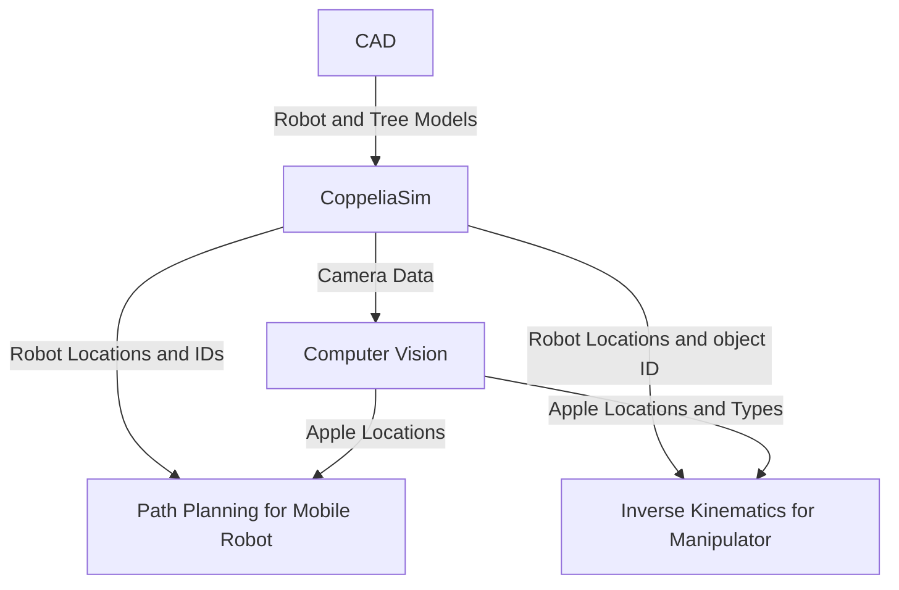

# Apple Picker Robot

## Team Members and Roles
#### Eva-Jessy Guech
Implemented the kinematics the robot arm manipulator uses to grab the apple and place it into the basket on the robot base plate
#### Amara Suehrstedt
Implemented computer vision for finding and sorting the different kind of apples. Got path planning to work with computer vision to get the robot to the apples. Worked on getting all components to work together. Worked on project description, approach for computer vision, flow chart.
#### Nathan Law
Created the CAD files for the robot, tree, some apples, and implemented both into CoppeliaSim. Also aided in testing path planning testing.
#### Henry Liu
Started path planning for the mobile robot to go to the apples.

## Introduction
For this project, we wanted to create a robot able to do a real-world task, but that also uses both a mobile robot and a manipulator. We settled on picking apples as it gave us room to change things if needed and gave many different approaches we could take. 
In this project, we will demonstrate a robot that will find and sort two different kinds of apples (good or bad), move to the apples, put the good apples into the basket on the robot, and the bad apples elsewhere. The ECSE 275 concepts we are using are path planning, inverse kinematics, and computer vision.

## Approach
### Overall Flow Chart

### CAD
The CAD for the custom robot was made in SolidWorks Assembly CAD. This software was used instead of directly modeling the pieces of the robot in coppeliasim to have greater control over part dimensions and alignment (distance between the two wheels). The robot was modeled as a larger version of the DYOR robot from Assignment 0 since having two driving wheels with one swivel wheel would make controlling and steering the robot simpler compared to four wheel drive. There is a tower in the middle for mounting the vision sensor for the robot. The brick on the back end of the robot is to counterweight the manipulator on the front of the robot. There were concerns that if the manipulator arm fully extended foward, then the entire robot could pitch foward. To remedy this, the base plate density could be increased, and the brick would ensure the weight was concentrated in the back of the robot to offset the manipulator's weight in the front. 

Some trial and error in implementation of the model. Moving parts were spaced so they do not overlap or touch eachother (swivel pieces and wheels are technically floating) 

The SolidWorks assembly was then converted into an STL file and imported into Coppeliasim. The robot was then set up in the same way as the instructions in Assignment 0: 
- Each of the individual parts was copied as a dynamic respondable shape on a different layer of the simulation  
- Each piece was either merged together or attatched to other pieces with a revolute joint
- ABB IRB 140 manipulator was attached to robot with a force sensor (to keep from falling off)

A tree with "branches"/shelves were added to Coppeliasim scene with various "apples" of various shapes to test robot's shape recognition. RGB was used to tweak colors to differentiate the "apples" from the tree. 

### Computer Vision
#### Shape_Recognition_HSV.py
The computer vision function was implemented using OpenCV, numpy, in python. It works by grabbing the image, sensor data, and sensor depth data from the vision sensor in CoppeliaSim. After this, it uses HSV thresholding to determine what is an apple, and what isn't. HSV was chosen over grayscale and RGB thresholding for its ability to threshold specific colors while also being more robust against lighting changes, as it seperates Hue from brightness and intensity. In this case, an apple is anything that has a HSV value between 0,65,65 and 10,255,255. This roughly translates to anything that is red. In the simulation, this allows us to ignore the details of the tree and the manipulator arm, so that no sorting has to be done later to ignore those objects. Once the HSV sorting is done, the contours of different objects are found, and a polygon is approximated from those contours, using a max difference of 3.5% of the arc length of the original contour to allow for a slightly simplified shape compared to the original contour. Using the approximated polygon, we are able to sort between good and bad apples based on how many sides each apple has. If it has more than 5 sides, it is considered a good apple, and otherwise it is considered a bad apple. After the apples are sorted, we are able to start finding the locations of the apples in the world.
  
This is done by computing the centroid of each apple by finding the moments, then grabbing the correct ones to find the x and y coordinates of the centroid. Then, the depth of the centroid coordinate is found using the depth data grabbed from the vision sensor earlier. Next, we are able to find the coordinates in the camera frame using the pinhole camera model and rotate those based off of the camera orientation and offset by the camera position to get the coordinates in the camera frame. However, this does not give the correct value of the z-coordinate in the world frame, as the orientation and position of the camera is only changing off of the x and y axis, not the z. To get the correct z coordinate in the world frame, it is overwritten to be equal to the y-coordinate in the world frame. Finally, the function returns two lists of floats, the first one is an Nx3 list containing the coordinates of each good apple, the second one is an Nx3 list containing the coordinates of each bad apple, where N is the number of apples in that list.

Experiments were conducted to find a good percentage value of the arc length so that the approximated polygons would be fairly consistent but not overly simplified or complicated that it would be nearly impossible to choose a constant value that would consistently sort the apples correctly. Another experiment was done to find the best max and min values for HSV thresholding that would ignore the other objects in the simulation but still detect the apples from far away. More experiments were done to test how far away the robot could be and still accurately compute the world coordinates of the apples, which ended up being approximately 3.5 meters. Even more tests were done to figure out if the robot could accurately find the apple coordinates when the robot is at different angles compared to the tree. Code was edited as there used to be an issue if the robot was less than 20 degrees off center compared to the tree.

The function also displays plots of what the camera is seeing: one with the polygon estimation overlayed, and another with both the polygon estimation and centroid point overlayed. Here is an example of the image output from the Computer Vision function:

### Inverse Kinematics for Manipulator Arm

# Kinematic Control System for Autonomous Harvesting (IRB 140)

**Course:** ECSE 275 - Robotics Design
**Focus:** Inverse Kinematics, Finite State Control, and System Integration

---

## 1. Role & Contribution

**My Role: Kinematics Implementation & System Integration**

In this group project to simulate an autonomous apple-picking robot, I was solely responsible for the **manipulation and control layer**. My contributions included:
* **Inverse Kinematics (IK):** Developed a robust Damped Least Squares (DLS) solver to handle singularities at the workspace boundary.
* **Finite State Machine (FSM):** Architected the Lua-based logic governing the robot's lifecycle (Approach $\to$ Grab $\to$ Lift $\to$ Drop).
* **Physics Stabilization:** Engineered a dynamic anchoring system to solve critical inertial instability issues during arm actuation.
* **Integration Bridge:** Built the ZMQ communication interface to translate raw Cartesian data from the Vision team into physical motor commands.

---

## 2. Problem Statement

The core challenge was to control a 6-Degree-of-Freedom (6-DOF) industrial manipulator (ABB IRB 140) mounted on a mobile base. The control system needed to:
1.  Accept asynchronous 3D target coordinates $(x, y, z)$ from an external vision system.
2.  Plan a collision-free path to the target.
3.  Execute the grab-and-drop sequence without destabilizing the mobile base.
4.  Handle edge cases where targets were near the limit of the robot's reachable workspace.

---

## 3. Technical Approach

### A. Inverse Kinematics: Damped Least Squares (DLS)
I selected the **Damped Least Squares** numerical method over the standard Pseudo-Inverse method for solving the inverse kinematics.

* **The Problem:** The robot frequently operates at full extension (0.8m reach) to access the tree canopy. In these configurations, the Jacobian matrix approaches singularity, causing standard solvers to demand infinite joint velocities ("jerking").
* **My Solution:** I implemented DLS, which introduces a damping factor $\lambda$ to the inversion:
    $$J^* = J^T (J J^T + \lambda^2 I)^{-1}$$
    This ensured smooth actuation and stability even when the arm was fully stretched.

### B. Finite State Machine (FSM) in Lua
To manage the complex sequence of actions, I structured the control logic as a Finite State Machine:
* `IDLE`: Listens for incoming ZMQ signals from the Python client.
* `APPROACH`: Solves IK to move the end-effector to the target coordinates.
* `GRAB`: Engages the suction gripper and **disables target physics** to prevent collision glitches during transport.
* `LIFT`: Executes a vertical Cartesian offset to clear the tree branches.
* `DROP`: Navigates to the bin location and releases the object.

### C. Dynamic Physics Anchoring (Stability Fix)
During testing, I identified a critical failure mode where the inertia of the moving arm caused the mobile base to shift and the wheel links to separate.
* **Implementation:** I developed a "Freeze-Thaw" logic.
    1.  Upon receiving a target, the script iterates through the robot's object hierarchy.
    2.  It dynamically sets the base and wheels to `Static` mode (anchoring it to the world).
    3.  Once the picking sequence is complete, it restores them to `Dynamic` mode, allowing the robot to navigate to the next tree.

---

## 4. Integration Architecture

I designed the system to decouple **Perception** from **Actuation**. I used a Client-Server model where my Lua script acts as the server listening for trajectory commands.

* **Input:** 4-Element Vector `[World_X, World_Y, World_Z, Object_Handle]` sent via ZMQ.
* **Processing:** My script parses this vector, validates the workspace limits, and feeds the coordinates to the IK solver.
* **Output:** Joint angles driving the 6 servo motors of the IRB 140.

---

## 5. Results & Performance

The kinematics engine was validated through a series of 10 automated harvesting trials.

| Metric | Performance | Analysis |
| :--- | :--- | :--- |
| **Success Rate** | **90%** (9/10) | The system successfully picked every apple within its physical workspace. The single failure was an edge case where the target was physically unreachable. |
| **Workspace Radius** | **0.85 meters** | Defined the effective "Kill Zone" for the manipulator. |
| **Motion Quality** | **Stable** | The DLS solver successfully eliminated high-velocity oscillations near singularities. |
| **Cycle Time** | **~4.0 seconds** | Optimized trajectory timing from Approach to Bin. |

### Visual Demonstration
*(Below is a demonstration of the IK solver handling a target acquisition and drop sequence)*

---

## 6. Conclusion

I successfully delivered a robust kinematic control layer for the autonomous harvester. The system effectively translates high-level Cartesian commands into low-level joint actuation while managing complex physics constraints.

The implementation of the **Damped Least Squares solver** proved essential for handling the singularity-prone workspace of an apple orchard, and the **Dynamic Anchoring** system resolved the physical instability inherent in mobile manipulation.
### Path Planning for Mobile Robot
#### Working_movement.py
This gets the robot location and joints to initialize movement. To find the target location, it calls the function inside Shape_Recognition_HSV.py to find target apples. Next it calculates how far away each apple is, and initializes movement for the nearest good apple. It calculates the speed using proportional control law. While moving towards the target, it checks how far away the base of the robot arm is from the target coordinates. Once the base of the arm is within 0.7m of the target, it stops for 20 seconds to allow the robot to pick up the robot. However, it does not lock the robot in place meaning it still moves freely due to the physics engine in the simulation. Below is a GIF of the robot getting to position before stopping movement.

