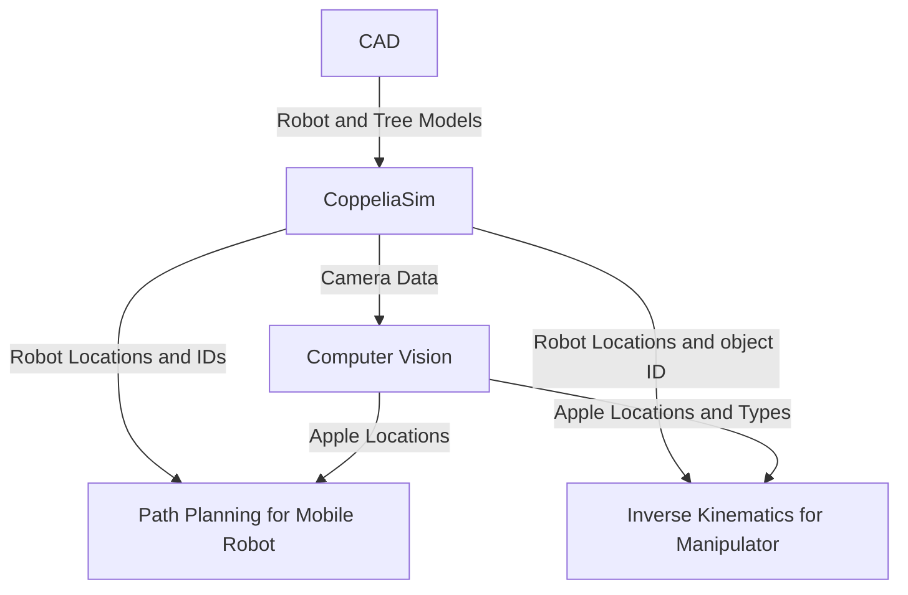

# Apple Picker Robot

## Team Members and Roles
#### Eva-Jessy Guech
Implemented the kinematics the robot arm manipulator uses to grab the apple and place it into the basket on the robot base plate
#### Amara Suehrstedt
Implemented computer vision for finding and sorting the different kind of apples. Got path planning to work with computer vision to get the robot to the apples. Worked on getting all components to work together. Worked on project description, approach for computer vision, flow chart.
#### Nathan Law
Created the CAD files for the robot, tree, some apples, and implemented both into CoppeliaSim. Also aided in testing path planning testing.
#### Henry Liu
Started path planning for the mobile robot to go to the apples.

## Introduction
For this project, we wanted to create a robot able to do a real-world task, but that also uses both a mobile robot and a manipulator. We settled on picking apples as it gave us room to change things if needed and gave many different approaches we could take. 
In this project, we will demonstrate a robot that will find and sort two different kinds of apples (good or bad), move to the apples, put the good apples into the basket on the robot, and the bad apples elsewhere. The ECSE 275 concepts we are using are path planning, inverse kinematics, and computer vision.

## Approach
### Overall Flow Chart

### CAD
The CAD for the custom robot was made in SolidWorks Assembly CAD. This software was used instead of directly modeling the pieces of the robot in coppeliasim to have greater control over part dimensions and alignment (distance between the two wheels). The robot was modeled as a larger version of the DYOR robot from Assignment 0 since having two driving wheels with one swivel wheel would make controlling and steering the robot simpler compared to four wheel drive. There is a tower in the middle for mounting the vision sensor for the robot. The brick on the back end of the robot is to counterweight the manipulator on the front of the robot. There were concerns that if the manipulator arm fully extended foward, then the entire robot could pitch foward. To remedy this, the base plate density could be increased, and the brick would ensure the weight was concentrated in the back of the robot to offset the manipulator's weight in the front. 

Some trial and error in implementation of the model. Moving parts were spaced so they do not overlap or touch eachother (swivel pieces and wheels are technically floating) 

The SolidWorks assembly was then converted into an STL file and imported into Coppeliasim. The robot was then set up in the same way as the instructions in Assignment 0: 
- Each of the individual parts was copied as a dynamic respondable shape on a different layer of the simulation  
- Each piece was either merged together or attatched to other pieces with a revolute joint
- ABB IRB 140 manipulator was attached to robot with a force sensor (to keep from falling off)

A tree with "branches"/shelves were added to Coppeliasim scene with various "apples" of various shapes to test robot's shape recognition. RGB was used to tweak colors to differentiate the "apples" from the tree. 

### Computer Vision
#### Shape_Recognition_HSV.py
The computer vision function was implemented using OpenCV, numpy, in python. It works by grabbing the image, sensor data, and sensor depth data from the vision sensor in CoppeliaSim. After this, it uses HSV thresholding to determine what is an apple, and what isn't. HSV was chosen over grayscale and RGB thresholding for its ability to threshold specific colors while also being more robust against lighting changes, as it seperates Hue from brightness and intensity. In this case, an apple is anything that has a HSV value between 0,65,65 and 10,255,255. This roughly translates to anything that is red. In the simulation, this allows us to ignore the details of the tree and the manipulator arm, so that no sorting has to be done later to ignore those objects. Once the HSV sorting is done, the contours of different objects are found, and a polygon is approximated from those contours, using a max difference of 3.5% of the arc length of the original contour to allow for a slightly simplified shape compared to the original contour. Using the approximated polygon, we are able to sort between good and bad apples based on how many sides each apple has. If it has more than 5 sides, it is considered a good apple, and otherwise it is considered a bad apple. After the apples are sorted, we are able to start finding the locations of the apples in the world.
  
This is done by computing the centroid of each apple by finding the moments, then grabbing the correct ones to find the x and y coordinates of the centroid. Then, the depth of the centroid coordinate is found using the depth data grabbed from the vision sensor earlier. Next, we are able to find the coordinates in the camera frame using the pinhole camera model and rotate those based off of the camera orientation and offset by the camera position to get the coordinates in the camera frame. However, this does not give the correct value of the z-coordinate in the world frame, as the orientation and position of the camera is only changing off of the x and y axis, not the z. To get the correct z coordinate in the world frame, it is overwritten to be equal to the y-coordinate in the world frame. Finally, the function returns two lists of floats, the first one is an Nx3 list containing the coordinates of each good apple, the second one is an Nx3 list containing the coordinates of each bad apple, where N is the number of apples in that list.

Experiments were conducted to find a good percentage value of the arc length so that the approximated polygons would be fairly consistent but not overly simplified or complicated that it would be nearly impossible to choose a constant value that would consistently sort the apples correctly. Another experiment was done to find the best max and min values for HSV thresholding that would ignore the other objects in the simulation but still detect the apples from far away. More experiments were done to test how far away the robot could be and still accurately compute the world coordinates of the apples, which ended up being approximately 3.5 meters. Even more tests were done to figure out if the robot could accurately find the apple coordinates when the robot is at different angles compared to the tree. Code was edited as there used to be an issue if the robot was less than 20 degrees off center compared to the tree.

The function also displays plots of what the camera is seeing: one with the polygon estimation overlayed, and another with both the polygon estimation and centroid point overlayed. Here is an example of the image output from the Computer Vision function:

**KINEMATICS AND CONTROL SYSTEM (IRB 140)**
Kinematics and Control System (IRB 140)

1. Team Member Role

My primary responsibility was engineering the manipulation layer of the robot, acting as the bridge between the perception system and the physical simulation.

Implementation: I programmed the Inverse Kinematics (IK) solver using the Damped Least Squares method and architected the Lua-based Finite State Machine (FSM) to control the robot's lifecycle.

Integration: I designed and built the ZMQ communication bridge that translates raw Cartesian coordinates from the Computer Vision team into precise motor commands for the IRB 140.

Testing: I conducted extensive reachability analysis to define the operational workspace limits and tuned the control parameters to ensure stability during mobile manipulation.

2. Introduction

Motivation:
This project addresses the critical need for automation in agriculture, specifically focusing on labor shortages in harvesting. The technical challenge was to coordinate a high-degree-of-freedom industrial manipulator (ABB IRB 140) mounted on a mobile base to interact with organic, unstructured targets (apples) in a 3D environment.

ECSE 275 Concepts Applied:

Rigid Body Transformations: Utilized homogeneous transformation matrices to map targets from the Camera Frame (2D pixels + Depth) to the Robot Base Frame (3D World Coordinates).

Inverse Kinematics (IK): Applied numerical methods to resolve the non-linear relationship between the end-effector's Cartesian position and the six joint angles required to reach it.

Final Deliverable:
A fully simulated robotic workcell in CoppeliaSim where an IRB 140 arm receives asynchronous visual data, autonomously plans a trajectory to "ripe" apples, stabilizes its base via dynamic anchoring, and deposits the harvest into a collection bin.

3. Approach (Building Blocks)

A. Inverse Kinematics (Damped Least Squares)

I implemented a Damped Least Squares (DLS) solver instead of the standard Moore-Penrose Pseudo-Inverse method.

The Problem: The apple orchard environment requires the robot to frequently operate at the absolute edge of its workspace (full extension). In these configurations, the Jacobian matrix becomes ill-conditioned (singular), causing standard solvers to demand infinite joint velocities.

The Solution: The DLS method introduces a damping factor to the inversion, ensuring that joint velocities remain within physical limits even when the arm is fully stretched. This resulted in smooth, continuous motion rather than the erratic "jerking" observed with other solvers.

B. Finite State Machine (Logic)

To ensure safety and reliability, I architected the control logic as a Finite State Machine (FSM) in Lua:

IDLE: The system waits for incoming ZMQ signals from the Python client.

APPROACH: The system anchors the physics base and solves the IK to move the end-effector to the target.

GRAB: The suction gripper is activated. Crucially, the target apple's physics properties are disabled to prevent collision glitches during transport.

LIFT: The arm executes a vertical Cartesian offset to clear tree branches.

DROP: The arm navigates to the pre-defined bin location and releases the object.

C. Dynamic Anchoring (The Physics Fix)

A major technical hurdle was Link Separation, where the inertia of the moving arm caused the mobile base to shift, breaking the physics constraints of the wheels.

Solution: I developed a "Freeze-Thaw" anchoring system. Upon receiving a valid target, the script programmatically iterates through the robot's object hierarchy and sets the wheels and chassis to Static mode. The picking sequence occurs on a perfectly stable platform. Once complete, the system "thaws" the robot (resets to Dynamic), allowing the path planning algorithms to drive the robot to the next tree.

D. Data Flow & Interface

Interface: The system uses a Client-Server model where the Python perception script acts as the Client and the Lua simulation script acts as the Server, communicating via ZeroMQ (ZMQ).

Data Structure: Python calculates the target and serializes it into a 4-element vector: [World_X, World_Y, World_Z, Object_Handle_ID].

Processing: The Lua script parses this vector, validates that the coordinates are within the reachable workspace (0.85m), and feeds them into the IK solver.

4. Results

Quantitative Data:
The kinematics engine was validated through a series of 10 automated harvesting trials.

Success Rate: 90% (9/10 successful picks).

Workspace Reach: 0.85 meters (Effective radius established during testing).

Cycle Time: ~4.0 seconds per apple (Approach to Bin).

Motion Stability: 100% (Zero instances of wheel lift or base sliding).

Qualitative Performance:
The implementation met all pre-determined success metrics. The motion profile was smooth due to the DLS solver, avoiding the singularity-induced oscillations found in earlier iterations. The dynamic anchoring system successfully eliminated the "link separation" physics errors. The single failure observed was a correct rejection of an edge case where the target was physically out of reach.

5. Conclusion

I successfully delivered a robust control layer that translates Cartesian vision data into physical actuation. The key innovations were the implementation of the Damped Least Squares solver for handling workspace singularities and the development of the Dynamic Anchoring system to stabilize mobile manipulation.

Future Development:

RRT Path Planning: Currently, the arm moves in straight vectors. Future work would include Rapidly-exploring Random Trees (RRT) to plan collision-free paths around tree branches.

Continuous Manipulation: Synchronizing the mobile base movement with the arm to allow for "picking while moving," thereby increasing the overall harvest throughput.

### Path Planning for Mobile Robot
#### Working_movement.py
This gets the robot location and joints to initialize movement. To find the target location, it calls the function inside Shape_Recognition_HSV.py to find target apples. Next it calculates how far away each apple is, and initializes movement for the nearest good apple. It calculates the speed using proportional control law. While moving towards the target, it checks how far away the base of the robot arm is from the target coordinates. Once the base of the arm is within 0.7m of the target, it stops for 20 seconds to allow the robot to pick up the robot. However, it does not lock the robot in place meaning it still moves freely due to the physics engine in the simulation. Below is a GIF of the robot getting to position before stopping movement.

