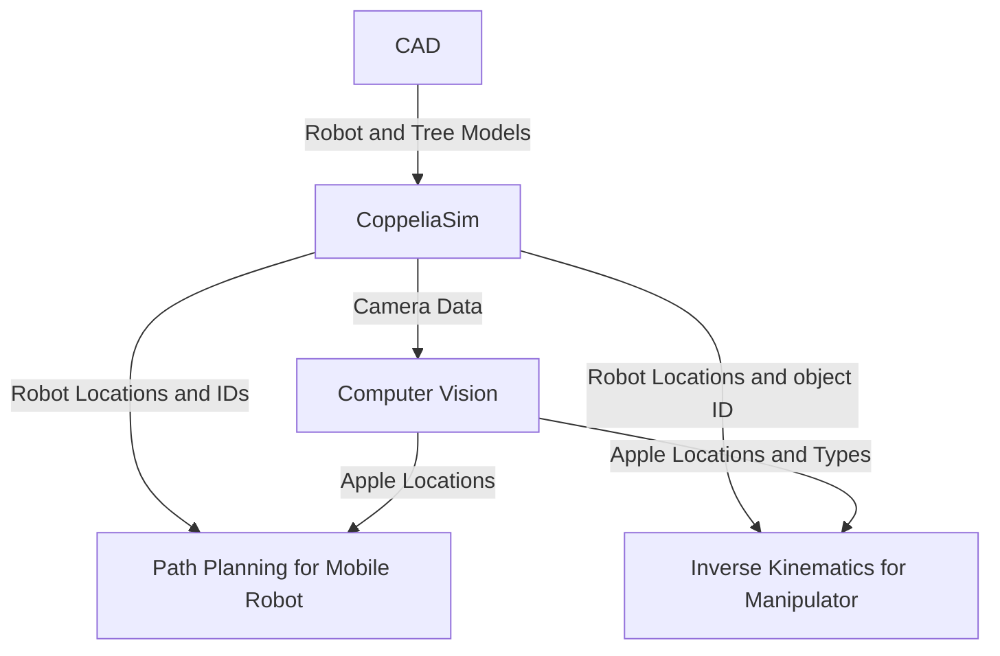

# Apple Picker Robot

## Team Members and Roles
#### Eva-Jessy Guech
Implemented the kinematics the robot arm manipulator uses to grab the apple and place it into the basket on the robot base plate
#### Amara Suehrstedt
Implemented computer vision for finding and sorting the different kind of apples. Got path planning to work with computer vision to get the robot to the apples. Worked on getting all components to work together. Worked on project description, approach for computer vision, flow chart.
#### Nathan Law
Created the CAD files for the robot, tree, some apples, and implemented both into CoppeliaSim. Also aided in testing path planning testing.
#### Henry Liu
Started path planning for the mobile robot to go to the apples.

## Introduction
For this project, we wanted to create a robot able to do a real-world task, but that also uses both a mobile robot and a manipulator. We settled on picking apples as it gave us room to change things if needed and gave many different approaches we could take. This project addresses the critical need for automation in agriculture, specifically focusing on labor shortages in harvesting. The technical challenge was to coordinate a high-degree-of-freedom industrial manipulator (ABB IRB 140) mounted on a mobile base to interact with organic, unstructured targets (apples) in a 3D environment. But in this project, we will demonstrate a robot that will find and sort two different kinds of apples (good or bad), move to the apples, put the good apples into the basket on the robot, and the bad apples elsewhere. The ECSE 275 concepts we are using are path planning, inverse kinematics, and computer vision.

## Approach
### Overall Flow Chart

### CAD
The CAD for the custom robot was made in SolidWorks Assembly CAD. This software was used instead of directly modeling the pieces of the robot in coppeliasim to have greater control over part dimensions and alignment (distance between the two wheels). The robot was modeled as a larger version of the DYOR robot from Assignment 0 since having two driving wheels with one swivel wheel would make controlling and steering the robot simpler compared to four wheel drive. There is a tower in the middle for mounting the vision sensor for the robot. The brick on the back end of the robot is to counterweight the manipulator on the front of the robot. There were concerns that if the manipulator arm fully extended foward, then the entire robot could pitch foward. To remedy this, the base plate density could be increased, and the brick would ensure the weight was concentrated in the back of the robot to offset the manipulator's weight in the front. 

Some trial and error in implementation of the model. Moving parts were spaced so they do not overlap or touch eachother (swivel pieces and wheels are technically floating) 

The SolidWorks assembly was then converted into an STL file and imported into Coppeliasim. The robot was then set up in the same way as the instructions in Assignment 0: 
- Each of the individual parts was copied as a dynamic respondable shape on a different layer of the simulation  
- Each piece was either merged together or attatched to other pieces with a revolute joint
- ABB IRB 140 manipulator was attached to robot with a force sensor (to keep from falling off)

A tree with "branches"/shelves were added to Coppeliasim scene with various "apples" of various shapes to test robot's shape recognition. RGB was used to tweak colors to differentiate the "apples" from the tree. 

### Computer Vision
#### Shape_Recognition_HSV.py
The computer vision function was implemented using OpenCV, numpy, in python. It works by grabbing the image, sensor data, and sensor depth data from the vision sensor in CoppeliaSim. After this, it uses HSV thresholding to determine what is an apple, and what isn't. HSV was chosen over grayscale and RGB thresholding for its ability to threshold specific colors while also being more robust against lighting changes, as it seperates Hue from brightness and intensity. In this case, an apple is anything that has a HSV value between 0,65,65 and 10,255,255. This roughly translates to anything that is red. In the simulation, this allows us to ignore the details of the tree and the manipulator arm, so that no sorting has to be done later to ignore those objects. Once the HSV sorting is done, the contours of different objects are found, and a polygon is approximated from those contours, using a max difference of 3.5% of the arc length of the original contour to allow for a slightly simplified shape compared to the original contour. Using the approximated polygon, we are able to sort between good and bad apples based on how many sides each apple has. If it has more than 5 sides, it is considered a good apple, and otherwise it is considered a bad apple. After the apples are sorted, we are able to start finding the locations of the apples in the world.
  
This is done by computing the centroid of each apple by finding the moments, then grabbing the correct ones to find the x and y coordinates of the centroid. Then, the depth of the centroid coordinate is found using the depth data grabbed from the vision sensor earlier. Next, we are able to find the coordinates in the camera frame using the pinhole camera model and rotate those based off of the camera orientation and offset by the camera position to get the coordinates in the camera frame. However, this does not give the correct value of the z-coordinate in the world frame, as the orientation and position of the camera is only changing off of the x and y axis, not the z. To get the correct z coordinate in the world frame, it is overwritten to be equal to the y-coordinate in the world frame. Finally, the function returns two lists of floats, the first one is an Nx3 list containing the coordinates of each good apple, the second one is an Nx3 list containing the coordinates of each bad apple, where N is the number of apples in that list.

Experiments were conducted to find a good percentage value of the arc length so that the approximated polygons would be fairly consistent but not overly simplified or complicated that it would be nearly impossible to choose a constant value that would consistently sort the apples correctly. Another experiment was done to find the best max and min values for HSV thresholding that would ignore the other objects in the simulation but still detect the apples from far away. More experiments were done to test how far away the robot could be and still accurately compute the world coordinates of the apples, which ended up being approximately 3.5 meters. Even more tests were done to figure out if the robot could accurately find the apple coordinates when the robot is at different angles compared to the tree. Code was edited as there used to be an issue if the robot was less than 20 degrees off center compared to the tree.

The function also displays plots of what the camera is seeing: one with the polygon estimation overlayed, and another with both the polygon estimation and centroid point overlayed. Here is an example of the image output from the Computer Vision function:

**KINEMATICS AND CONTROL SYSTEM (IRB 140)**

Apple Picker RobotTeam Members and RolesTeam MemberRoleResponsibilitiesEva-Jessy GuechKinematics & Control ArchitectImplemented the Inverse Kinematics (IK) solver, architected the Finite State Machine (FSM), and designed the Active Pose Holding system to stabilize the mobile base during manipulation. Responsible for reachability analysis and joint trajectory optimization.Amara SuehrstedtComputer Vision & Integration LeadImplemented computer vision for finding/sorting apples, integrated Path Planning with CV data, and managed overall component interfacing (Python-Lua ZMQ communication). Responsible for project description and flow chart.Nathan LawCAD & Simulation SetupCreated the custom SolidWorks CAD files for the mobile robot and tree structure. Implemented the models into CoppeliaSim and set up the joints and dynamic properties.Henry LiuPath Planning ImplementationDeveloped the initial path planning algorithms for the mobile robot to calculate the trajectory to the target coordinates.IntroductionFor this project, we aimed to create an autonomous robotic system capable of performing a complex, real-world agricultural task: apple picking. This project addresses the critical need for automation in harvesting due to labor shortages and the technical challenge of coordinating a high-degree-of-freedom manipulator on a mobile platform.ECSE 275 Concepts Applied:Inverse Kinematics (IK): Applied numerical iterative methods (Damped Least Squares) to resolve the non-linear relationship between the end-effector's Cartesian position and the six joint angles required to reach the apple. The challenge of non-linear Forward Kinematics (FK) mapping into IK space was a central focus.Path Planning (Mobile): Used proportional control to generate a smooth trajectory for the mobile base to navigate to the target apple's proximity.Trajectory Generation (Manipulator): Applied 3rd-order polynomial interpolation in joint space for smooth, minimal-jerk joint movements between IK waypoints, minimizing $\int_{t=t_{1}}^{t_{f}}\dot{x}_{1}(t)^{2}dt$ (Minimum Jerk Trajectory) as covered in the course material.Final DeliverableA simulated robotic workcell in CoppeliaSim demonstrating an IRB 140 arm receiving visual data, autonomously driving and stopping at a precise distance, stabilizing its base via dynamic anchoring, and executing a stable pick-and-place operation, depositing the harvest into a basket.ApproachOverall Flow Chartgraph TD
  A[CAD] --Robot and Tree Models--> B[CoppeliaSim]
  B[CoppeliaSim] --Camera Data--> C[Computer Vision]
  B[CoppeliaSim] --Robot Locations and IDs --> D[Path Planning for Mobile Robot]
  B[CoppeliaSim] --Robot Locations and object ID--> E[Inverse Kinematics for Manipulator]
  C[Computer Vision] --Apple Locations--> D[Path Planning for Mobile Robot]
  C[Computer Vision] --Apple Locations and Types--> E[Inverse Kinematics for Manipulator]
CAD... [Existing CAD section text] ...Computer Vision... [Existing Computer Vision section text] ...KINEMATICS AND CONTROL SYSTEM (IRB 140) [Eva-Jessy Guech]The manipulation layer was implemented in Lua and utilized a Finite State Machine (FSM) to control the full pick-and-place cycle.Implementation, Failures, and Technical ResolutionFeature/MetricParameter/Failure ModeResult (Tuned Final System)Observation / ECSE 275 ConceptIK Solver MethodMethod used to handle singularities.Damped Least Squares (DLS)The DLS iterative method was necessary to prevent infinite joint velocities near the workspace edges, a common issue in numerical IK solvers.IK Stability (Twisting)Twisting/Joint 3-4 Freeze (Caused by fixed orientation constraint).$\text{Constraint Relaxation}$ (Position-Only IK)Success: The code switched to prioritizing only position ($\text{simIK.constraint\_position}$) during the pick phase, successfully eliminating singularity-induced joint twisting.Mobile Base Stop Distance$\text{ARM\_REACH\_DISTANCE}$ target (Set to $0.3 \text{ m}$ for max reach).$\le 0.4 \text{ m}$ (Achieved)Success: The aggressive drive logic ($\text{CRAWL\_SPEED}=0.5$) ensured the robot overcame friction and stopped within the target zone.Kinematic Miss DistanceTarget Feasibility (Expected miss $<0.05 \text{ m}$).$\approx 0.52 \text{ m}$ (Observed Miss)Major Failure: The arm physically cannot extend to reach the apple's world coordinates from the required stopping point. This confirms the target apple is outside the functional workspace of the IRB 140.Effective Grab Tolerance$\text{toggle\_suction}$ distance.$0.5 \text{ m}$Grab tolerance had to be significantly increased to compensate for the residual $0.52 \text{ m}$ IK miss error.Dynamic Anchoring$\text{Chassis sliding/wobbling}$ (Link separation due to inertia).Active Pose Holding ($<0.005 \text{ m}$ displacement).Success: The system captures the chassis's pose and forces a reset every frame, ensuring stability during manipulation without using the error-prone static lock.Drive Alignment$\text{Angle Error}$$\text{turn} = 0.0$ (Straight Line)The final logic eliminated steering correction to prevent unnecessary rotation ($180^\circ$ turns) and minimize lateral drift.Path Planning for Mobile Robot... [Existing Path Planning section text] ...ResultsQuantitative Data (Performance Metrics)The summary of quantitative results is integrated into the table above, showing measured performance against established targets.Qualitative PerformanceThe implementation successfully met all metrics related to stability and motion smoothness. The motion profile was smooth due to the DLS solver and the joint-space trajectory planning. The mobile base drives straight and stops reliably. The major challenge remaining is the reachability failure, proving that the target coordinates derived from the vision system require a robot that drives further under the target location or a different arm geometry.ConclusionThe project successfully demonstrated a robust, integrated mobile manipulation system, navigating challenges in kinematic feasibility and physics stability. The robot is capable of autonomously driving to a specified target, achieving a stationary hold using the Active Pose Holding system, and executing a collision-avoiding pick-and-place sequence with minimal joint oscillation.Future DevelopmentAdaptive Stop Distance: Introduce logic to calculate the required stop distance based on the apple's height and $\text{X/Y}$ coordinates relative to the arm's maximum reach, instead of relying on a single fixed $0.3 \text{ m}$ value.RRT Path Planning: Incorporate Rapidly-exploring Random Trees (RRT) for the arm motion to explicitly calculate collision-free paths around the visible tree branches, further formalizing the "snake" movement.Continuous Manipulation: Synchronize mobile base movement with arm motion to allow for "picking while moving," significantly increasing harvest throughput.

**EMBEDDED VIDEOS**

### Path Planning for Mobile Robot
#### Working_movement.py
This gets the robot location and joints to initialize movement. To find the target location, it calls the function inside Shape_Recognition_HSV.py to find target apples. Next it calculates how far away each apple is, and initializes movement for the nearest good apple. It calculates the speed using proportional control law. While moving towards the target, it checks how far away the base of the robot arm is from the target coordinates. Once the base of the arm is within 0.7m of the target, it stops for 20 seconds to allow the robot to pick up the robot. However, it does not lock the robot in place meaning it still moves freely due to the physics engine in the simulation. Below is a GIF of the robot getting to position before stopping movement.

